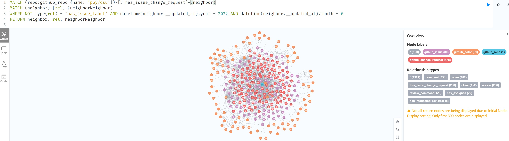
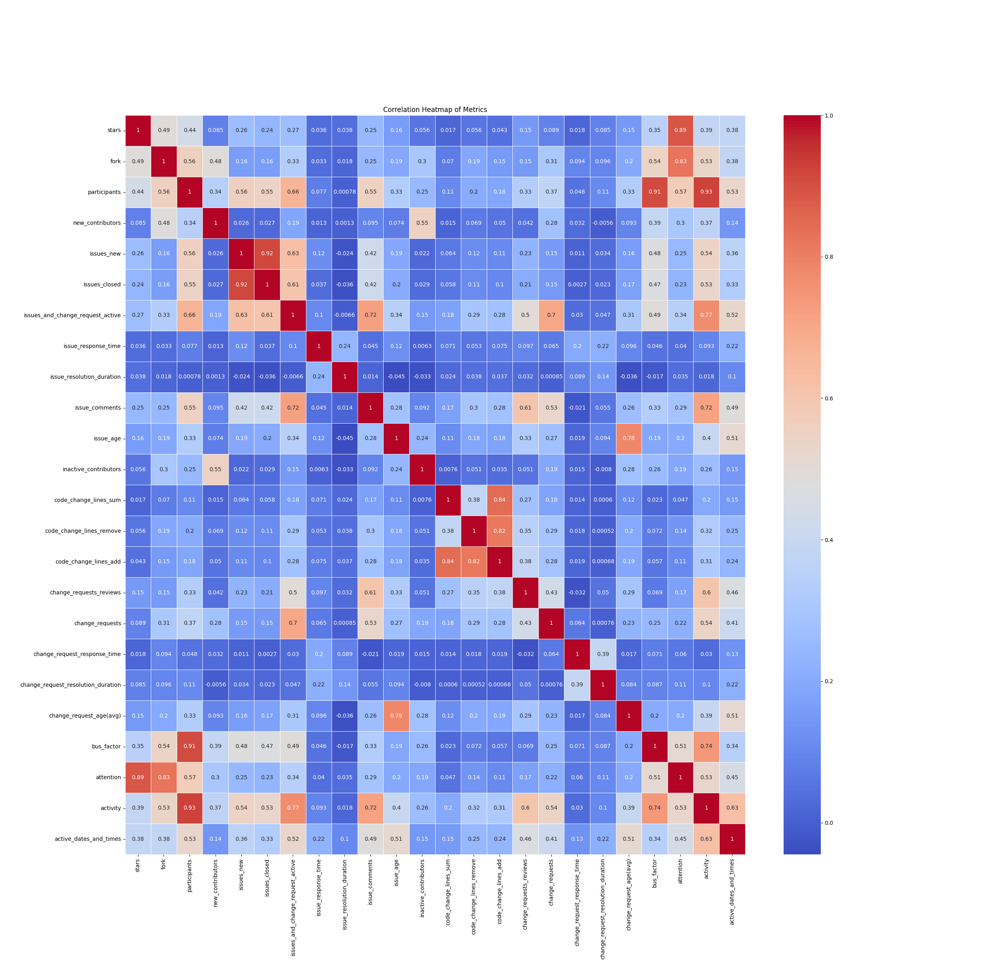
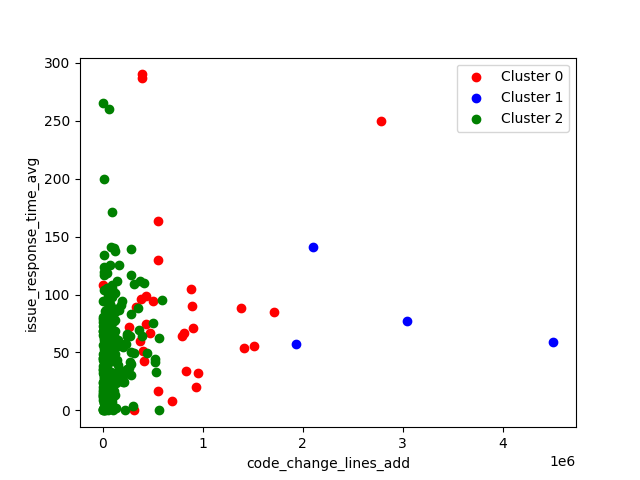
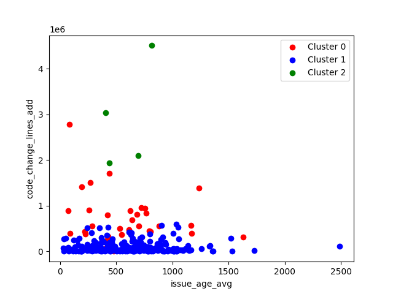
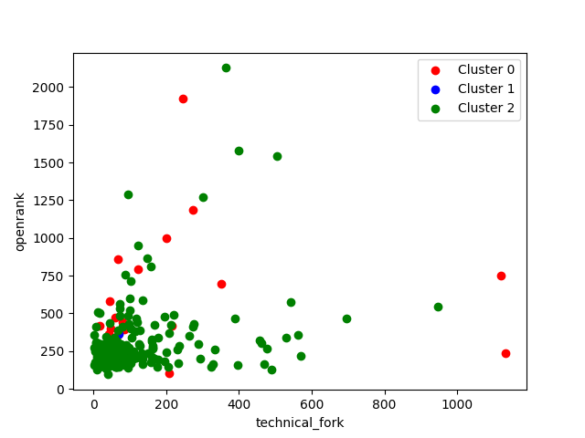
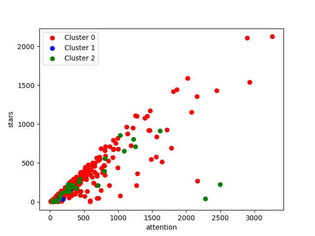
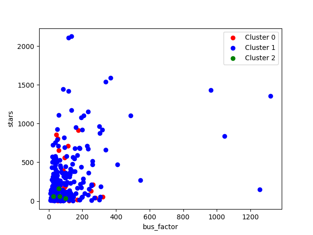
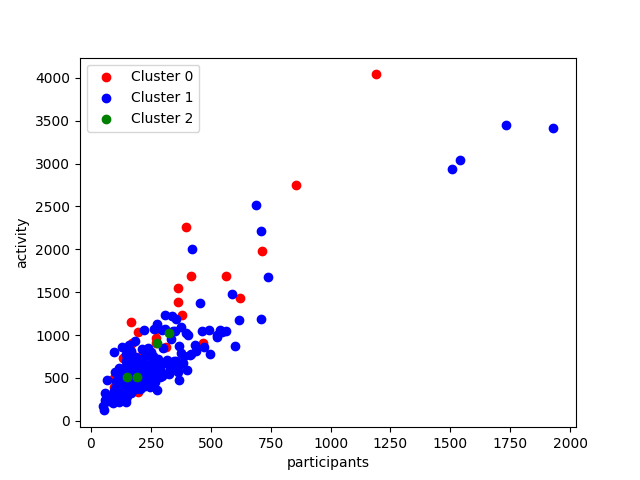
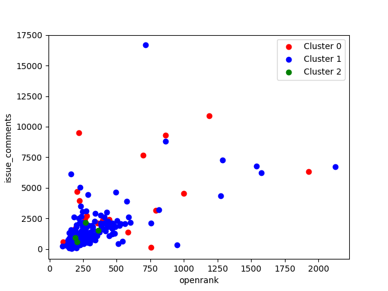
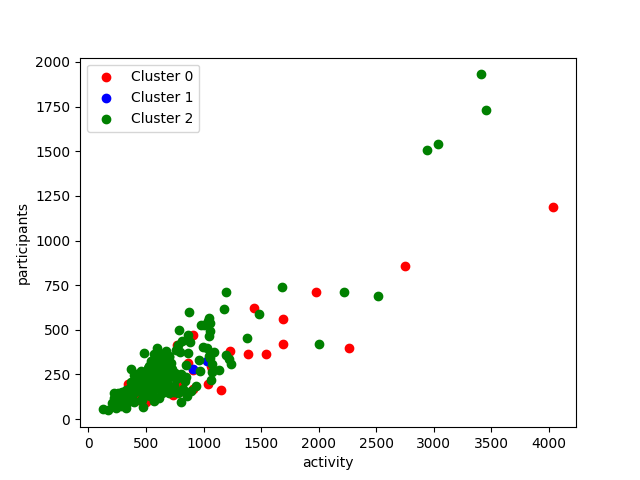

# 1、背景介绍
OpenDigger 是一个搭建在GitHub上的开源项目，为我们提供了海量的各类指标数据。在这些数据中，最核心的指标之一便是项目的全域 OpenRank 指标。项目全域 OpenRank 指标基于开发者与仓库的协作关系网络，依据 OpenRank 算法，生成了一个具有时序信息的网络指标。这个指标能有效地揭示一个项目在开源生态中的协作影响力。  

除此之外，OpenDigger项目还有许多其他的统计型指标，比如CHAOSS指标体系中的各类指标。这些指标关注项目的各个方面可以采集到的统计数据，而全域OpenRank指标则更注重结果，不关注细节的统计数据，只关注有影响力的开发者在项目中的深度参与和活跃。因此，我们可以通过拟合统计型指标来模拟 OpenRank 指标，以解决一些重要问题，例如确定哪些统计型指标对于拟合网络型指标更为重要，以及在无法简单获得全域数据的情况下（如 Gitee、GitLab 上的项目）如何估计其 OpenRank 指标。

针对以上问题我们进行了数据处理、数据分析、模型设计、结果验证四个方面的工作来保证模型的性能优良，总体工作内容如下图：

# 2、数据处理
## 2.1 数据收集
数据收集是数据处理的首要步骤，也是至关重要的环节。为了满足项目需求，我们将从OpenDigger项目中获取时间序列数据，并从GitHub仓库中收集异质图数据。

### 2.1.1 时间序列数据

OpenDigger为我们提供了一系列统计指标，它们可用于描述仓库的历史状态，开发者的活动状况，代码贡献等各方面的信息。我们将收集包括但不限于以下类型的时间序列数据：  

仓库活跃度数据：包含star数量、fork数量、issue数量、PR（Pull Request）数量等，这些数据反映了仓库的热度和活跃度。
开发者活动数据：包含开发者的提交次数、开发者参与的issue和PR数量等，这些数据反映了开发者的活动情况和贡献状况。
代码贡献数据：包含代码的提交次数、代码的修改行数等，这些数据反映了代码的贡献情况。

### 2.1.2 异质图数据
异质图数据的收集将主要依赖于GitHub仓库中的issue，PR和actor如图。以下是我们收集异质图数据的步骤：  
收集issue数据：我们将收集所有issue的信息，包括issue的创建者、参与者、创建时间、关闭时间、状态等，这些数据能反映issue的处理情况和开发者的协作情况。  
收集PR数据：我们将收集所有PR的信息，包括PR的创建者、参与者、创建时间、合并时间、状态等，这些数据能反映PR的处理情况和开发者的协作情况。   
收集actor数据：我们将收集所有actor的信息，包括actor的ID、参与的issue和PR数量等，这些数据反映了actor的活动情况。  
完成这些数据的收集后，我们将构建一个异质图G。在此异质图中，节点代表actor，issue和PR，边表示actor与issue、actor与PR以及issue与PR之间的关联关系。边的权重可以根据actor之间的协作频率或其他相关度量进行赋值。这个异质图能够揭示开发者、issue和PR之间的复杂交互关系，为后续的网络分析和模型构建提供基础。  

以上就是我们的数据收集过程。在获取这些数据后，我们将进行后续的数据处理和分析工作。

## 2.2 格式转换
格式转换是数据处理过程中的重要一环，能确保我们收集的原始数据适应接下来的数据清洗和分析。在本项目中，我们需要进行两项主要的格式转换：一是将Json格式数据转换为CSV格式，二是将图数据转换为数值型数据。   

### 2.2.1 Json转CSV

Json数据在网络传输和数据交换中广泛使用，由于其自我描述性好和易于读写的特点，许多Web API都选择使用Json格式输出数据。然而，对于数据分析来说，CSV格式更具优势，因为CSV可以直接导入到大多数数据分析软件和数据库中，且文件占用空间较小，读取速度快。   

在OpenDigger项目中收集的时间序列数据初步以Json格式存在。我们将对300个仓库收集到的不同的metrics的json文件的数据进行重新整合，输出对应的csv文件。每个csv文件对应了一个metric，文件的属性值由仓库名和时间构成。

实验具体过程如下：先导入所需的模块，并定义输入和输出文件路径。在获取输入文件夹中所有仓库文件夹的路径后，初始化一个集合以存储唯一的时间值。遍历每个仓库文件夹，并查找Json文件。使用Python的Pandas库中的read_json函数读取Json数据，然后使用to_csv函数将数据框（DataFrame）转换为CSV格式。

### 2.2.2 图转数值

异质图数据是一种复杂的结构化数据，无法直接应用于大多数机器学习算法。因此，我们需要将图数据转换为数值型数据。

这个过程通常包含两个步骤：

- 节点嵌入：节点嵌入是将图中的节点映射到一个低维度的向量空间中，使得在图中相互连接或者具有相似邻居的节点在向量空间中的距离较近。这样，每个节点就可以用一个向量来表示，向量中的数值反映了节点在图中的位置和角色。
- 边的数值化：边的数值化通常依赖于边的权重，如果边的权重已经是数值，那么这个步骤可以省略。如果边的权重不是数值，那么需要进行转换，比如将频繁协作的关系转换为高权重，偶尔协作的关系转换为低权重。

我们主要是用边的数值化，将统计的数值加入我们的特征选择中来。主要的统计特征是Issue和PR的节点数、项目参与者的数量和边的数量，示例如下：   
| Repository                    | IssueAndPRCount | ActorCount | EdgeCount |
|-------------------------------|-----------------|------------|-----------|
| AdguardTeam/AdguardFilters    | 2887            | 178        | 13970     |
| ArduPilot/ardupilot           | 199             | 84         | 1853      |
| Automattic/jetpack            | 323             | 172        | 3373      |
| Automattic/wp-calypso         | 944             | 374        | 8817      |
| Azure/azure-cli               | 465             | 488        | 4955      |
| Azure/azure-powershell        | 423             | 165        | 3073      |

## 2.3 数据清洗
数据清洗是数据预处理过程中至关重要的一步，能确保我们的数据准确无误，适合进行分析。我们将进行以下几个主要的数据清洗步骤：  

### 2.3.1 统一数据格式
数据可能来自于多个来源，每个来源的数据格式可能会有所不同。为了后续的处理和分析，我们需要将所有的数据统一到同一种格式。在这个步骤中，我们会检查所有数据的格式，例如日期时间格式、数字的表示格式等，并进行必要的转换。

例如其中代表每个月的字段的格式有`2022-01-01 00:00:00`和`2022-01`,我们对个字段统一数据格式为`2022-01`

### 2.3.2 删除无用值
因为我们要求是拟合OpenRank，但是提供的仓库里面OpenRank并不是所有月份都有值的，所以我们就以OpenRank在某月存在的值为基础，删除了OpenRank在该月份没有值的其他特征的数据。
### 2.3.3 补充缺失值
有一些特征在该月份的值有缺失，我们选取了该仓库在这个特征的中位数来补充缺失值。但是有一些仓库在这些月份都没有特征，我们就直接删除了这个仓库，防止编造的数据无法现实真是情况导致降低了模型效果。

## 2.4 融合特征
特征融合是数据处理的重要环节，它的目标是通过结合现有特征，创造新的特征以增强模型的预测能力。以下是我们将进行的一些主要的特征融合步骤：

### 2.4.1 求和
对于某些具有相同度量单位或具有实际意义的特征，求和操作可以提供额外的信息。active_dates_and_times这一metric的数据用0-10表示 24（时）* 7（天） 个格子内项目的活跃度，对这一特征的融合处理采用了求和的方式，将列表中 24 * 7 个值进行了求和。`change_request_age`的"level"值在融合特征的过程中也采用了求和的方式，将"level"所表示的四个分段里不同的人数进行了求和处理。`activity_details`这一特征的数据结构例如`"2015-01"":["vbagirov",11.18],["Alex-302",10.68],["ameshkov",8.19]`，其中第一个元素表示用户的 GitHub ID,第二个元素表示用户的活跃度。`bus_factor_detail`这一特征的数据结构形如`"2015-01":["vbagirov",12],["Alex-302",11]`，其中第一个元素表示用户的 GitHub ID，而第二个元素表示用户的 `bus factor`。对`activity_details`和`bus_factor_detail`这两个特征，在处理过程中，将同一时间下不同用户的活跃度和巴士系数进行了求和。
### 2.4.2 求平均
平均值能提供一组数据的中心趋势，对于多个相似特征，求平均可以抵消个别异常值的影响，提供稳定的预测效果。例如`change_request_age`代表的是每个PR请求的处理的时间，`change_request_response_time_avg`代表的是PR回复的次数，`issue_resolution_duration`代表的是已解决issue的时间，`issue_response_time_avg`代表的是issue第一次回复的时间等。这些特征统一求平均值进行处理。

# 3. 数据分析

通过阅读OpenDigger对于top300_metrics 指标数据说明，发现这些指标用于描述项目的开发活动、社区参与度、受欢迎程度、问题解决效率及其在开源社区中的影响力和等方面的情况。比如，attention，stars和participants这三个指标，能够反映项目的社区规模和吸引力；而从active_dates_and_times和activity这两个指标中，能够观察到项目的活跃程度；与issue相关的issue_age，issue_comments，issue_resolution_duration，issue_response_time，issues_and_change_request_active，issues_closed，issues_new这几个指标描述了对问题的讨论和参与程度以及问题解决的效率，同时也衡量了问题讨论的及时性，反映了项目的开发和讨论活动。 

## 3.1 相关性分析
相关性分析是一种统计方法，用于评估两个或多个变量之间的关联程度。相关性分析不仅能帮助我们了解哪些特征可能对目标变量有影响，还可以帮助我们检测并处理多重共线性问题。

## 3.1.1 all metrics之间的相关性

首先对所有metrics进行分析，用相关性热力图的方式进行可视化分析。实验结果如下所示：

从热力图中可以观察到不同指标之间的相关性。颜色越接近红色表示正相关，颜色越接近蓝色表示负相关。以下是一些相关性系数较高的指标对之间的观察结果： 

&emsp;&emsp;1.activity 与 participants 相关性系数为 0.93：这表明项目的活跃程度与参与者数量呈现较强的正相关性，活跃的项目通常吸引更多的参与者。  
&emsp;&emsp;2.issue_closed 与 issue_new 相关性系数为 0.92：这表示已关闭的问题数量与新问题数量之间存在较强的正相关性，可能意味着项目在解决问题的同时还在不断接收新的问题。  
&emsp;&emsp;3.bus_factor 与 participants 相关性系数为 0.91：这表明项目的参与者数量与项目的巴士因子之间存在较强的正相关性，即项目参与者的多少与项目的可持续性和稳定性有关。  
&emsp;&emsp;4.attention 与 stars 相关性系数为 0.89：这意味着项目的关注度与星标数之间存在较强的正相关性，受关注度高的项目通常也会有更多的星标。  
&emsp;&emsp;5.attention 与 forks 相关性系数为 0.83：这表示项目的关注度与复制数之间存在较强的正相关性，关注度高的项目通常也会有更多的复制。  
&emsp;&emsp;6.issue_age 与 change_request_age 相关性系数为 0.78：这表明问题的年龄与变更请求的年龄之间存在较强的正相关性，可能意味着问题和变更请求的处理时间相对接近。  
&emsp;&emsp;7.activity 与 issues_and_change_request_active 相关性系数为 0.77：这表示项目的活跃程度与正在进行中的问题和变更请求之间存在一定的正相关性，活跃的项目通常也会有更多的进行中的问题和变更请求。  
&emsp;&emsp;8.activity 与 bus_factor 相关性系数为 0.74：这表示项目的活跃程度与项目的巴士因子之间存在一定的正相关性，活跃的项目可能会有更高的巴士因子。  
&emsp;&emsp;9.activity 与 issue_comments 相关性系数为 0.72：这表示项目的活跃程度与问题的评论数量之间存在一定的正相关性，活跃的项目通常会有更多的问题评论。  
&emsp;&emsp;10.issues_and_change_request_active 与 issue_comments 相关性系数为 0.72：这表明进行中的问题和变更请求的数量与问题的评论数量之间存在一定的正相关性，进行中的问题和变更请求可能会引发更多的评论。  
&emsp;&emsp;10.code_change_lines_add、code_change_lines_remove、code_change_lines_sum 三者之间的相关性系数都在 0.8 以上：这表示代码添加行数、代码删除行数和代码总变更行数之间存在较高的正相关性，说明在变更中添加和删除代码的行为通常是同时发生的。

### 3.1.2 openrank与其余metrics之间的相关性分析  

为进一步探讨metrics之间的关系，分别取各metric与openrank进行单独的相关性分析，用Pearson和Spearman两个指标进行衡量。由实验结果可见，其中activity,  attention, participants, change_request_age, issues_and_change_request_active, issue_comments, issue_new, issue_closed, stars和forks都与openrank有较高的相关性。对于AdguardFilters和airbytehq仓库，将各个metric与openrank的相关性进行了可视化展示，其中AdguardFilters仓库的一些实验结果如下图所示。通过可视化展示，可以更直观地观察到这些指标与openrank之间的关系，与上述实验得到的结果相符合，比如openrank与activity，change_request_age，issues_and_change_request_active在散点图中基本都呈现了正相关的关系。

 
 
 
 
 
 
 
 
  
 
  
 

## 3.2 聚类分析
综合了25项metrics对300个仓库进行kmean聚类分析。在聚类过程中，经过数据处理将下述仓库聚为了三类，并将结果用于之后的分类模型中文件中。各仓库具体的分类结果如下表所示。

| cluster       | nums |
|:-------------:|:----:|
| 0             | 33   |
| 1             | 228  |
| 2             | 4    |
| 因数据指标不完备未参与聚类的仓库 | 35   |

并得到如下两个评价指标的值：  

1.聚类结果的轮廓系数： 0.6883621440112111。这表明聚类结果整体上是比较合理的，样本在各自聚类中相对紧密，并且与其他聚类相对分离。  
2.聚类结果的Calinski-Harabasz指数： 236.77734106570458。这表明聚类结果的稠密程度较高，聚类之间的分离度较好，整体上说明了较好的聚类效果。

为进一步分析得到的聚类结果，对聚完的类进行可视化输出，部分结果如下图所示。从图中可以观察到一些特点：首先，在 technical_fork 和 openrank 这两个维度上，聚类效果不太明显，散点分布较为分散。这可能意味着这两个指标对于聚类结果的区分度较低。其次，在 stars 和 attention 这两个维度上，聚类效果也相对一般，散点分布相对比较均匀。这可能表示 stars 和 attention 这两个指标对于聚类结果的影响有限。在 stars 和 bus_factor，以及 participants 和 activity 这两组中，cluster=2 的散点基本集中在左下角，即 stars 与 bus_factor，participants 与 activity 都较小的部分。而在 issue_response_time_age 和 code_change_lines_add，以及 issue_age_avg 和 code_change_lines_add 这两组中，聚类效果相对较好，三类之间的离散程度较明显。这表明在这些指标组合下，不同类别之间存在明显的差异和特征。  

 
 
 
   

在GitHub上查阅了不同类的项目的readme文件，总结发现Cluster=0的项目提供了各种工具、库和平台，用于开发、部署和管理各种应用和系统，而Cluster=1的项目大多与data相关，多用于处理和管理数据，Cluster=2的项目都与Microsoft Azure云平台相关，提供了不同的工具和库，以便开发人员能够与Azure进行交互和管理。  

此外，结合了2023年3月23日这300个仓库的一些指标所对应的值，能够发现Cluster=0的仓库的forks、activity、participants和openrank值大于Cluster=1和2的仓库所对应的值，而Cluster=2的又大于Cluster=1的仓库所对应的上述metrics的值。

综上，结合项目功能与项目发展阶段，我们可以发现Cluster=0的项目，即平台工具类项目，往往具有较高的forks、activity、participants和openrank值。这可能是因为平台工具往往是广泛应用的基础设施工具，吸引了更多的关注、参与和贡献。这些项目可能具有大量的用户和开发者社区，因此在GitHub上的活跃度和参与度较高。Cluster=1的项目，即与数据相关的项目，可能相对于平台工具类项目在上述指标上有较低的值。这可能是因为数据处理和管理项目的使用范围和需求相对较特定，因此吸引的关注和参与度可能相对较少。Cluster=2的项目解决特定领域问题的项目，是为了便于开发人员能够与Azure进行交互和管理，可能在上述指标上相对于数据相关项目有更高的值，但相对于平台工具类项目较低。这可能是因为这些项目针对特定的功能或问题，吸引了相关领域的专业人士和使用者的关注，但规模和普及度可能相对较小。  

## 3.3 特征工程
对前述重新整合数据得到的代表各metrics的csv文件进行聚类处理，聚类结果的Calinski-Harabasz指数为8.917060166458873，因此可以看出聚类结果的紧密度欠佳且不同聚类之间的分离度也较低。由此可以推断对metrics进行降维效果可能较一般或不佳。因此我们没有采用特征降维方法

因为 OpenRank 有部分是继承上个月的 OpenRank 值，因此我们对所有特征基于时间序列构造了比例特征，特征转移公式如下：

$x_{ij} = x_{(i-1)j} \cdot \text{coef} + x_{ij}$  

这个公式描述了一个时间序列的更新过程，其中每个特征值根据上一个时间步的特征值乘以一个系数进行更新。

$x_{ij}$ 表示第 $i$ 个时间步中第 $j$ 个特征列的特征值。
$x_{(i-1)j}$ 表示上一个时间步中第 $j$ 个特征列的特征值。
$\text{coef}$ 是乘法运算中的系数，用于调整更新的幅度。
根据这个公式，每个特征值 $x_{ij}$ 被更新为上一个时间步的特征值 $x_{(i-1)j}$ 乘以系数 $\text{coef}$ 后的结果再加上原特征值 $x_{ij}$。

这种更新方式可以用于在时间序列数据中，通过利用过去的特征值来影响当前的特征值，从而捕捉时间相关性和趋势。通过调整系数 $\text{coef}$ 的大小，可以控制过去特征值对当前特征值的影响程度。

# 4. 实验设计
## 4.1 总体设计

在进行实验设计时，我们将采取一种分步进行的策略，先对数据进行预处理，然后比较不同的模型和超参数，最后使用交叉验证来评估模型的泛化能力，如上图。以下是我们的实验总体设计：

## 4.2 数据归一化
数据归一化是预处理步骤中的一个重要环节，目的是将所有的特征标准化到同一尺度。对于数据归一化，我们将使用Min-Max归一化方法。Min-Max归一化是一种简单而常用的归一化方法，其公式为：

$X_{normalized} = (X - X_{min}) / (X_{max} - X_{min})$

在这个公式中，X是原始特征值，$X_{min}$ 和 $X_{max}$ 分别是特征值的最小值和最大值。通过这种方法，原始特征值会被线性缩放到0到1的范围内。

采用这种方法的好处是，不仅可以将各种规模和量纲的特征值转化到同一尺度，而且它不会改变原始数据的分布。而且，这种方法对于那些在原始尺度上可能会导致数值不稳定的模型（例如，神经网络或K-最近邻）特别有用。

## 4.3 不同模型对比与超参数调优
选择正确的模型和适当的超参数是机器学习任务中的关键步骤。不同的模型对应着不同的假设和数学原理，而超参数则控制着模型的特定表现。以下是我们将要考虑的一些主要模型以及相应的超参数：

1. **线性回归 (Linear Regression):**
线性回归假设目标变量和特征之间存在线性关系。线性回归模型的参数通常通过最小化预测误差的平方和来确定，无需额外的超参数。

1. **决策树 (Decision Tree):**
决策树是一个非参数的学习方法，能够从数据特征中学习决策规则。决策树的主要超参数是max_depth，表示树的最大深度，其值的范围可以从1到9。

1. **支持向量机 (Support Vector Machine):**
支持向量机是一个二分类模型，可以通过引入核函数来处理非线性分类问题。主要的超参数包括kernel，它定义了数据在高维空间中的映射方式，可以选择'linear'、'poly'、'rbf'或'sigmoid'；C是一个正则化参数，它定义了模型对误分类样本的惩罚力度，可以选择1或10。

1. **K-最近邻 (K-Nearest Neighbors):**
K-最近邻算法根据输入实例的k个最近邻的训练实例的类别来预测输入实例的类别。主要的超参数是n_neighbors，表示选择最近邻居的数量，其值的范围可以从1到9。

1. **随机森林 (Random Forest):**
随机森林是一种基于决策树的集成学习方法，通过构造多个决策树并取其平均结果来提高预测性能。主要的超参数是n_estimators，表示决策树的数量，可以选择100，200或300。

1. **梯度提升 (Gradient Boosting):**
梯度提升也是一种基于决策树的集成学习方法，通过在每一轮中增加一个新的弱学习器来纠正前一轮的预测错误。主要的超参数包括learning_rate，表示每个弱学习器的贡献，可以选择0.1或0.01；n_estimators，表示弱学习器的数量，可以选择100或200。

1. **AdaBoost:**
AdaBoost是一种基于决策树的集成学习方法，通过增加分类错误的样本权重来引导后续的弱学习器。主要的超参数与梯度提升相同，包括learning_rate和n_estimators。

1. **coef:**
根据基于时间序列构造了比例特征公式：  
$x_{ij} = x_{(i-1)j} \cdot \text{coef} + x_{ij}$  
需要确定超参数 `coef` 的值。

对于机器学习算法的超参数，我们使用GridSearch方法，通过遍历给定的参数组合来进行模型选择。例如，SVM模型中调整C（惩罚系数）和kernel（核函数类型）参数，你可能会给出一个参数列表如：`C=[1,10]` 和 `kernel=['linear', 'rbf']` 。GridSearch将会试验所有的参数组合，即 `[ (1, 'linear'), (1, 'rbf'), (10, 'linear'), (10, 'rbf')]`，总共4种组合，然后根据预先设定的评估标准来评估每种参数组合的性能，最终选出表现最好的参数组合。

对于基于时间序列构造的比例特征超参数 `coef`，我们对`[0.1, 0.2, 0.3, 0.4, 0.5]` 这个五个值进行了对比实验，找到最优参数。

以上是我们的模型选择和超参数调优过程。我们将对每种模型进行交叉验证以评估其预测性能，然后选择预测性能最好的模型以及相应的超参数。

## 4.4 不同集群训练模型
首先，我们通过聚类分析将数据划分为三个独立的集群。每个集群代表一组具有相似特征的数据点。这意味着在每个集群中的数据点可能在特征空间中彼此靠近，并且与其他集群的数据点有显著的差异。这是一种无监督学习方法，我们只是根据数据本身的特性来将数据划分为不同的集群，而不是根据预定义的标签或类别。  

然后，我们将对每个集群单独进行模型训练。这意味着我们将有三个独立的模型，每个模型专门用于对特定集群的数据进行预测。这种方法的优点是每个模型可以专注于捕捉其特定集群的数据特性，而不需要考虑其他集群的数据特性。这可能会提高预测的准确性，特别是当不同集群的数据有显著差异时。

## 4.4 交叉验证
交叉验证是一种评估模型泛化能力的重要方法，它通过将数据集分为训练集和验证集，并进行多次训练和验证，来评估模型在未见过的数据上的表现。我们将使用K折交叉验证，即将数据集分为K份，轮流将每一份作为验证集，其余的作为训练集，进行K次训练和验证。然后，我们将这K次验证的结果进行平均，以获得模型的平均性能。

以上就是我们的实验总体设计。在每一步，我们都将记录和评估我们的结果，这将帮助我们了解哪些方法在我们的任务上表现最好，以便我们可以进一步优化和改进我们的模型。

# 5. 实验结果
## 5.1 评估指标
在模型训练完成后，我们需要评估模型的性能。评估指标能够量化模型的预测能力，从而使我们能够比较不同模型或者同一模型的不同设置。对于回归任务，常用的评估指标有以下几种：
1. **均方误差 (Mean Squared Error, MSE):**
均方误差是实际值和预测值之间的差值的平方的平均值。它的计算公式为：
$$
MSE = \frac{1}{n} \sum_{i=1}^{n} (y_i - \hat{y}_i)^2
$$

2. **均方根误差 (Root Mean Squared Error, RMSE):**
均方根误差是均方误差的平方根。它的计算公式为：
$$
RMSE = \sqrt{MSE}
$$

3. **平均绝对误差 (Mean Absolute Error, MAE):**
平均绝对误差是实际值和预测值之间的绝对差值的平均值。它的计算公式为：
$$
MAE = \frac{1}{n} \sum_{i=1}^{n} |y_i - \hat{y}_i|
$$

4. **R平方 (决定系数, R-squared):**
R平方提供了一个衡量模型如何拟合实际数据的指标。它的计算公式为：
$$
R^2 = 1 - \frac{SS_{res}}{SS_{tot}}
$$
其中，$SS_{res}$是残差平方和，$SS_{tot}$是总平方和。

5. **可解释方差 (Explained Variance):**
可解释方差度量了我们的模型能解释的数据的方差的比例。一个1.0的得分表示完美拟合。它的计算公式为：
$$
\text{Explained Variance} = 1 - \frac{Var(y - \hat{y})}{Var(y)}
$$

6. **最大误差 (Max Error):**
最大误差度量计算了预测值和实际值之间最糟糕的误差。它的计算公式为：
$$
\text{Max Error} = max(|y_i - \hat{y}_i|)
$$

7. **中位绝对误差 (Median Absolute Error):**
中位绝对误差是所有实际值和预测值之间的绝对差值的中位数。它的计算公式为：
$$
\text{Median Absolute Error} = median(|y_1 - \hat{y}_1|, |y_2 - \hat{y}_2|, ..., |y_n - \hat{y}_n|)
$$

## 5.2 同一数据集不同模型
  
我们对所有的模型超参数都使用GraidSearch方法选择最优超参数，同一数据集不同模型表现如下：
1. 均方误差 (MSE) 和 均方根误差 (RMSE): 这两个指标越小，表示模型的预测能力越好。从给出的数据中可以看出，K-最近邻 (K-Nearest Neighbors) 模型在这两个指标上表现最好，随机森林 (Random Forest) 和梯度提升 (Gradient Boosting) 紧随其后。

2. 平均绝对误差 (MAE): 这个指标越小，表示模型的预测能力越好。同样，K-最近邻模型在这个指标上也表现最好，随机森林和决策树(Decision Tree)紧随其后。

3. R平方 (R-squared) 和 可解释方差 (Explained Variance): 这两个指标越大，表示模型的预测能力越好。从给出的数据中可以看出，K-最近邻模型在这两个指标上表现最好，随机森林紧随其后。

4. 最大误差 (Max Error): 这个指标越小，表示模型的预测能力越好。梯度提升模型在这个指标上表现最好，但AdaBoost和K-最近邻模型的表现并不差。c，随机森林和决策树紧随其后。

总的来说，根据给出的数据，我们可以看出K-最近邻模型在大部分指标上表现最好，表现出较好的预测能力。

## 5.3 不同`coef`超参数

  

上图中，我们可以看到不同的`coef`变化对模型的影响。`coef`大小从0.0到0.5变化，这可能表示的是上个月的特征值继承到次月特征值的比例，例如0.0可能表示无上个月的特征值继承，而0.5则可能表示继承上个月一半的特征值数据进行训练。

可以看出K-Nearest Neighbors（K最近邻）和Random Forest（随机森林）在所有训练集大小下都表现得相对较好。特别是在训练集大小为0.4的情况下，K-Nearest Neighbors模型的MSE, RMSE, MAE均是最小的，且R-squared值最接近1，表现最佳。最终结果如下表：  

| Model | Metric | Value |
|-------|--------|-------|
| Linear Regression | MSE | 5741.83 |
| Linear Regression | RMSE | 75.77 |
| Linear Regression | MAE | 48.31 |
| Linear Regression | R-squared | 0.92 |
| Linear Regression | Explained Variance | 0.92 |
| Linear Regression | Max Error | 864.09 |
| Linear Regression | Median Absolute Error | 30.82 |
| Decision Tree | MSE | 4767.73 |
| Decision Tree | RMSE | 69.05 |
| Decision Tree | MAE | 43.71 |
| Decision Tree | R-squared | 0.93 |
| Decision Tree | Explained Variance | 0.93 |
| Decision Tree | Max Error | 735.18 |
| Decision Tree | Median Absolute Error | 27.67 |
| Support Vector Machine | MSE | 5818.08 |
| Support Vector Machine | RMSE | 76.28 |
| Support Vector Machine | MAE | 45.87 |
| Support Vector Machine | R-squared | 0.92 |
| Support Vector Machine | Explained Variance | 0.92 |
| Support Vector Machine | Max Error | 1495.06 |
| Support Vector Machine | Median Absolute Error | 30.22 |
| **K-Nearest Neighbors** | **MSE** | **1507.32** |
| **K-Nearest Neighbors** | **RMSE** | **38.82** |
| **K-Nearest Neighbors** | **MAE** | **19.77** |
| **K-Nearest Neighbors** | **R-squared** | **0.98** |
| **K-Nearest Neighbors** | **Explained Variance** | **0.98** |
| **K-Nearest Neighbors** | **Max Error** | **914.11** |
| **K-Nearest Neighbors** | **Median Absolute Error** | **10.53** |
| Random Forest | MSE | 1775.32 |
| Random Forest | RMSE | 42.13 |
| Random Forest | MAE | 24.82 |
| Random Forest | R-squared | 0.98 |
| Random Forest | Explained Variance | 0.98 |
| Random Forest | Max Error | 555.88 |
| Random Forest | Median Absolute Error | 14.44 |
| Gradient Boosting | MSE | 2797.52 |
| Gradient Boosting | RMSE | 52.89 |
| Gradient Boosting | MAE | 35.66 |
| Gradient Boosting | R-squared | 0.96 |
| Gradient Boosting | Explained Variance | 0.96 |
| Gradient Boosting | Max Error | 606.68 |
| Gradient Boosting | Median Absolute Error | 23.95 |
| AdaBoost | MSE | 7898.83 |
| AdaBoost | RMSE | 88.88 |
| AdaBoost | MAE | 66.42 |
| AdaBoost | R-squared | 0.89 |
| AdaBoost | Explained Variance | 0.89 |
| AdaBoost | Max Error | 856.10 |
| AdaBoost | Median Absolute Error | 55.42 |

所以，如果根据这些指标来判断，K-Nearest Neighbors模型在训练集大小为0.4的情况下性能最优。

## 5.4 不同的cluster

我们利用之前的聚类工作，然后选取`coef=0.4` 作为数据集的时间序列比例特征的超参数，针对不同的聚类类别分别训练模型。根据上图数据，我们可以对每个集群使用的不同模型进行比较和分析。我们会根据均方误差(MSE)、均方根误差(RMSE)、平均绝对误差(MAE)、R-平方、解释方差、最大误差和中位绝对误差等指标进行评估。

Cluster 0：在这个集群中，K-Nearest Neighbors模型在所有的评价指标上都表现出最好的性能，包括MSE（3245.1214893318966）、RMSE（56.965967817038766）、MAE（26.056077586206893）、R-squared（0.9756942858677656）、Explained Variance（0.9756993906247605）、Max Error（596.475）、Median Absolute Error（12.154999999999959）。这表明在Cluster 0中，K-Nearest Neighbors模型提供了最精确的预测。

Cluster 1：在这个集群中，K-Nearest Neighbors模型在大多数的评价指标上也表现出最好的性能，包括MSE（1743.7803447561691）、RMSE（41.758596058250916）、MAE（20.440599294947123）、R-squared（0.9720252607118147）、Explained Variance（0.972049975378679）、Max Error（674.9549999999999）和Median Absolute Error（10.439999999999984）。这表明在Cluster 1中，K-Nearest Neighbors模型也提供了最精确的预测。

Cluster 2：在这个集群中，虽然K-Nearest Neighbors模型在许多评价指标上的表现非常好，但是在某些指标上，如MSE（429.2845619409178）和RMSE（20.719183428429744）等，Gradient Boosting模型的表现更优。同时，Gradient Boosting模型在Median Absolute Error（6.8527243187445315）上也表现出优秀的性能。这表明在Cluster 2中，K-Nearest Neighbors模型和Gradient Boosting模型都能提供较好的预测。

**cluster 0:**  
| Metric | Linear Regression | Decision Tree | Support Vector Machine | K-Nearest Neighbors | Random Forest | Gradient Boosting | AdaBoost |
|--------|-------------------|---------------|------------------------|---------------------|---------------|-------------------|----------|
| MSE    | 9145.10           | 6296.49       | 18300.75               | **3245.12**         | 3943.51       | 3299.01           | 10679.87 |
| RMSE   | 95.63             | 79.35         | 135.28                 | **56.96**           | 62.79         | 57.43             | 103.34   |
| MAE    | 61.54             | 48.35         | 86.93                  | **26.05**           | 29.44         | 35.09             | 76.20    |
| R2     | 0.93              | 0.95          | 0.86                   | **0.97**            | 0.97          | 0.97              | 0.92     |
| EV     | 0.93              | 0.95          | 0.86                   | **0.97**            | 0.97          | 0.97              | 0.92     |
| ME     | 730.12            | 633.69        | 853.46                 | **596.47**          | 791.80        | 580.37            | 929.49   |
| MedAE  | 38.38             | 31.46         | 48.57                  | **12.15**           | 15.90         | 23.21             | 66.42    |

**Cluster 1:**  

| Metric | Linear Regression | Decision Tree | Support Vector Machine | K-Nearest Neighbors | Random Forest | Gradient Boosting | AdaBoost |
|--------|-------------------|---------------|------------------------|---------------------|---------------|-------------------|----------|
| MSE    | 5724.20           | 4200.63       | 4958.16                | **1743.78**         | 1873.88       | 2624.68           | 7403.73  |
| RMSE   | 75.65             | 64.81         | 70.41                  | **41.75**           | 43.28         | 51.23             | 86.04    |
| MAE    | 46.23             | 40.20         | 40.43                  | **20.44**           | 23.90         | 33.38             | 63.52    |
| R2     | 0.90              | 0.93          | 0.92                   | **0.97**            | 0.96          | 0.95              | 0.88     |
| EV     | 0.90              | 0.93          | 0.92                   | **0.97**            | 0.96          | 0.95              | 0.88     |
| ME     | 1226.86           | 705.85        | 1363.42                | **674.95**          | 657.77        | 571.61            | 866.68   |
| MedAE  | 29.60             | 26.27         | 25.71                  | **10.43**           | 14.51         | 22.98             | 52.76    |

**Cluster 2:**

| Metric | Linear Regression | Decision Tree | Support Vector Machine | K-Nearest Neighbors | Random Forest | Gradient Boosting | AdaBoost |
|--------|-------------------|---------------|------------------------|---------------------|---------------|-------------------|----------|
| MSE    | 533.18            | 499.30        | 771.02                 | **373.15**          | 462.77        | 429.28            | 543.31   |
| RMSE   | 23.09             | 22.34         | 27.76                  | **19.31**           | 21.51         | 20.71             | 23.30    |
| MAE    | 16.23             | 15.12         | 19.77                  | **13.54**           | 13.73         | 11.83             | 17.38    |
| R2     | 0.96              | 0.96          | 0.94                   | 0.97                | 0.96          | **0.96**          | 0.96     |
| EV     | 0.96              | 0.96          | 0.94                   | 0.97                | 0.96          | **0.96**          | 0.96     |
| ME     | 87.76             | 103.98        | 105.37                 | **71.38**           | 114.64        | 117.90            | 100.95   |
| MedAE  | 11.47             | 9.85          | 13.16                  | 8.49                | 9.06          | **6.85**          | 13.71    |

总的来说，在不同的集群中，K-Nearest Neighbors模型的表现总体上是最好的，但在Cluster 2中，Gradient Boosting模型在某些指标上也表现出了较好的性能。

# 结论

本次研究的主要目标是通过拟合统计型指标，模拟 OpenRank 指标，以确定哪些统计型指标对于拟合网络型指标更为重要。我们首先对 GitHub 仓库的一系列度量进行了描述性分析，并根据这些度量对仓库进行了聚类。然后，我们在每个聚类上独立训练了一系列回归模型，并使用不同的评价指标对模型的预测性能进行了评估。同时，我们还调整了不同模型的超参数，并使用了不同的数据归一化技术。以下是我们研究的主要结论：

- 基于25个度量指标对GitHub仓库进行的K-means聚类分析产生了三个不同的聚类（Cluster 0, 1, 2）。聚类的效果良好，评价指标轮廓系数和Calinski-Harabasz指数的值分别为0.688和236.78。通过查阅每个聚类中的仓库的 readme 文件，我们发现 Cluster 0 主要包含了提供各种工具、库和平台的项目，Cluster 1 的项目主要与数据处理和管理相关，而 Cluster 2 的项目主要与 Microsoft Azure 云平台相关。

- 对于基于时间序列构造的比例特征，我们在五个值（0.1, 0.2, 0.3, 0.4, 0.5）之间寻找最优参数，并在 coef=0.4 时取得了最佳的预测性能。

- 基于全部数据训练了八种不同的模型：线性回归、决策树、支持向量机、K-最近邻、随机森林、梯度提升、AdaBoost 和 coef。这些模型的目标是根据统计型指标拟合 OpenRank 指标。我们使用了多种评价指标（MSE、RMSE、MAE、R-squared、Explained Variance、Max Error 和 Median Absolute Error）来评估这些模型的预测性能。大多数情况下，K-最近邻模型在所有的聚类中都表现得最好，其均方误差（MSE）为1507.32，均方根误差（RMSE）为38.82，平均绝对误差（MAE）为19.77，决定系数（R-squared）为0.98，解释方差（Explained Variance）也为0.98，最大误差（Max Error）为914.11，而中位绝对误差（Median Absolute Error）为10.53。这些指标显示，K-最近邻模型对数据的拟合度非常高，预测的准确度也相当高。特别地，R-squared 值接近1，说明模型能够解释大部分的数据变动；而相比其他模型，K-最近邻模型的MSE、RMSE、MAE以及Median Absolute Error的值都相对较低，说明模型的预测误差较小。

- 在每个聚类上独立单独的模型，其中数据也表明K-最近邻模型对数据的拟合度非常高，预测的准确度也相当高。并且不同的聚类集群中评测指标有优于全部数据一起进行训练的模型，证明我们的分类进行预测的方法的有效性。

总体来看，本研究的结果表明，使用机器学习方法对 GitHub 仓库的 OpenRank 指标进行预测是可行的，其中 K-最近邻模型的表现最好。此外，我们的研究还揭示了一些有趣的发现，例如，GitHub 仓库的 OpenRank 指标可能与其类型（如工具/库/平台、数据处理/管理或与 Microsoft Azure 相关）和度量指标（如 forks、activity、participants 等）有关。尽管我们的模型在训练集上的预测性能良好，但我们还需要在更大的测试集上进一步验证这些结果。未来的研究可以探索更多的特征和模型，以进一步提高预测的准确性。